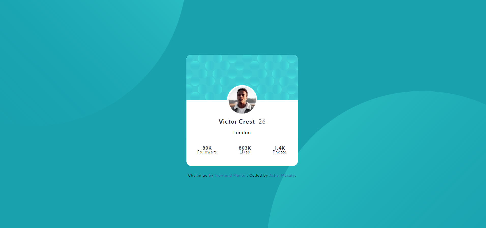
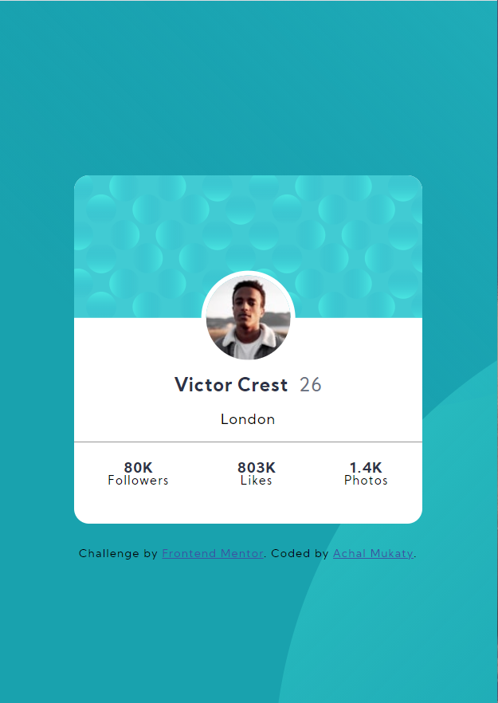

# Frontend Mentor - Profile card component


## Table of contents

- [Overview](#overview)
  - [The challenge](#the-challenge)
  - [Screenshot](#screenshot)
  - [Links](#links)
- [My process](#my-process)
  - [Built with](#built-with)
  - [What I learned](#what-i-learned)
  - [Continued development](#continued-development)
  - [Useful resources](#useful-resources)

- [Acknowledgments](#acknowledgments)

**Note: Delete this note and update the table of contents based on what sections you keep.**

## Overview
I am a newbie in world of front-end developer. I have a basic understanding of HTML, CSS and Js. So I started out this amazing challenge to build out this profile card component and get it looking as close to the design as possible.
So if you've got something you'd like to practice, feel free to give it a go.


## Welcome! 👋

Thanks for checking out this front-end coding challenge.

[Frontend Mentor](https://www.frontendmentor.io) challenges help you improve your coding skills by building realistic projects.

**To do this challenge, you need a basic understanding of HTML and CSS.**

# Frontend Mentor - Profile card component solution

This is a solution to the [Profile card component challenge on Frontend Mentor](https://www.frontendmentor.io/challenges/profile-card-component-cfArpWshJ). Frontend Mentor challenges help you improve your coding skills by building realistic projects. 


### The challenge

- Build out the project to the designs provided and it should look as close to the design as possible.

### Screenshot

**This is a desktop view**



**This is a mobile view**




### Links

- Solution URL: [Add solution URL here](https://your-solution-url.com)
- Live Site URL: [Add live site URL here](https://your-live-site-url.com)

## My process

1. Firstly, gave a close look to the design provided. Divided UI design into different components.
2. Set the main/parent div called card which has child classes called card-top for placing top image inside card and card-content for all the hearder and dp
3. A div class class called card-footer for placing values and aliging this using flex, setting flex-direction to column.
4. Providing other styling properties for each class.


### Built with

- Semantic HTML5 markup
- CSS custom properties
- Flexbox
- media


### What I learned

I learnt how to use divs and styling components like - flex, transform, position, how to align items, how to handle text font size and color, how to use border and how to play with background - images, url etc.


### Snippet of Code

```css
. {
  display: flex;
  flex-direction: column;
}
```
```css
. {
  @media (max-width:480px){
    
  }
 }
```

## Author

- Website - [Achal Mukaty](https://achalmukaty.netlify.app/)
- Frontend Mentor - [@yashmukaty](https://www.frontendmentor.io/profile/yashmukaty)
